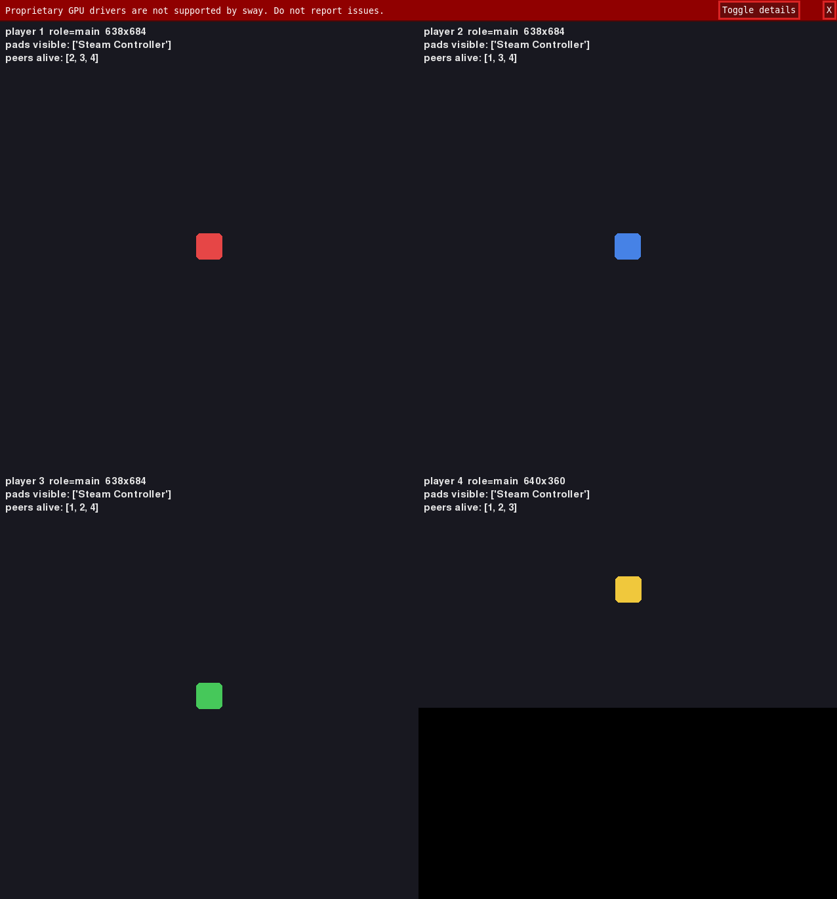
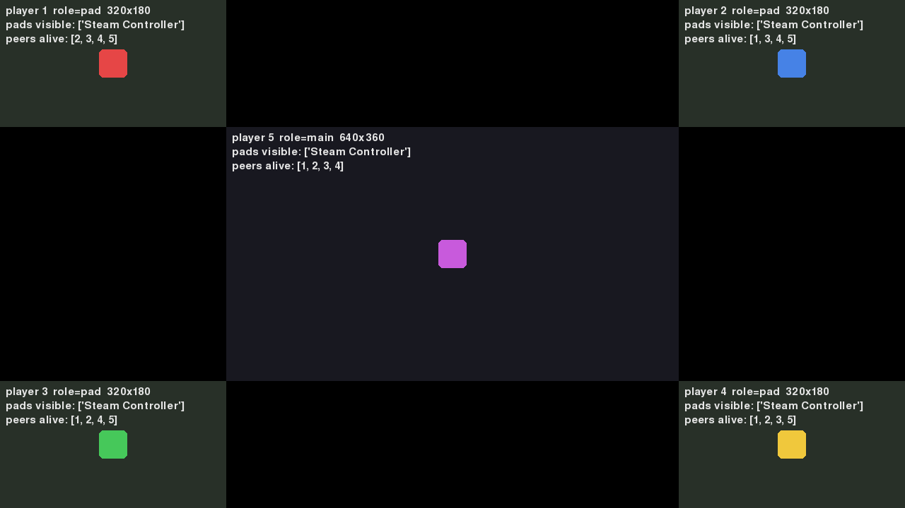
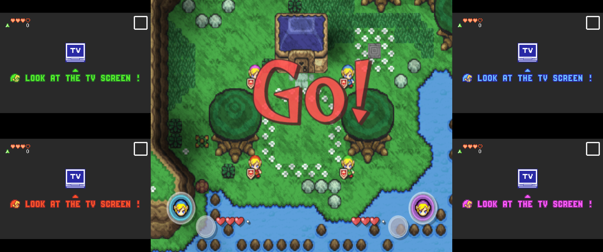

# splitscreen-mvp

Game-invariant local split-screen for Linux (Wayland). Takes N instances of
*any* game, shows them inside **one window**, and gives each instance its own
input devices. No per-game handler is needed.

Verified on NixOS with sway 1.12, gamescope 3.16, Python 3.14 (see `docs/`).

| `examples/grid4.json` (4 instances, 2x2) | `examples/hub5.json` (Four Swords style: main + 4 corners) |
|---|---|
|  |  |

## How it works

```
host compositor (any Wayland desktop)
└── nested sway  ← ONE host window = the whole split screen (fullscreen it, record it, move it)
    ├── [gamescope -W w -H h] → [bwrap: only /dev/input/eventA visible] → game instance 1
    ├── [gamescope -W w -H h] → [bwrap: only /dev/input/eventB visible] → game instance 2
    └── ...
```

| Concern | Mechanism | Game-agnostic because |
|---|---|---|
| Combining windows into one | Nested `sway` (wlroots, with XWayland). `splitscreen.session` connects to its IPC socket, listens for new windows, and places each into a layout slot. | Any Wayland *or* X11 game runs unmodified inside a nested compositor. |
| Which window belongs to which instance | PID lineage: the window's PID is walked up `/proc` until it hits a PID we spawned (`splitscreen.procmatch`). | Works through gamescope, bwrap, wine, launch scripts: no title/class matching. |
| Forcing the game to a slot size | Optional per-instance `gamescope -W w -H h --force-windows-fullscreen`. | The game sees a "monitor" of exactly the slot size; fullscreen games just work. |
| Gamepad isolation | `bwrap --tmpfs /dev/input` plus `--dev-bind` of only the assigned nodes; other `/dev/hidraw*` masked with `/dev/null` (`splitscreen.sandbox`). Same trick as PartyDeck. | SDL/evdev/hidapi never enumerate the other players' devices. Gamepads keep working unfocused. |
| Keyboards as controllers | `splitscreen.kbd2pad`: grabs a keyboard (EVIOCGRAB), emits a uinput gamepad that identifies as an Xbox 360 pad, and only that node is bound into the sandbox. | The game just sees one gamepad. No game-side key mapping. |
| Keeping a game in its slot | The nested sway refuses fullscreen at map time, and `splitscreen.session` re-places any window that fullscreens or resizes itself, for as long as the session runs. | A game's own video options cannot take the frame; it is undone within a quarter second. |
| Layout | Pure functions in `splitscreen.layout`: `grid` (any N) and `hub` (center + 4 corners). Recomputed from the real output size, so host tiling/resizing is fine. | Layout never touches the game. |

## Run it

```bash
nix-shell                                   # python (pygame-ce, evdev, i3ipc, pytest), sway, gamescope, bwrap, grim
python3 -m pytest -q tests                  # 149 tests, incl. a uinput round-trip if /dev/uinput is writable
python3 -m splitscreen.session examples/grid4.json
python3 -m splitscreen.session examples/hub5.json
python3 -m splitscreen.session examples/isolation2.json   # one sandboxed instance, one under gamescope
```

Without nix: install `sway`, `bubblewrap`, `gamescope` and `pip install pygame-ce evdev i3ipc`.
The user must be in the `input` group for `devices` / `keyboard_to_pad`.

The dummy game (`dummy_game/game.py`) is one process per player; instances share
state over localhost UDP so every window shows every player. Its HUD prints
which gamepads that instance can see, which makes isolation visible.

## Config

```jsonc
{
  "frame": {"width": 1280, "height": 720},          // requested host window size (best effort)
  "layout": {"name": "hub", "center_fraction": 0.5}, // or "grid"; a "mode" can write this instead
  "gamescope": true,                                // default for every instance below
  "instances": [
    {
      "id": "p1",
      "command": ["./game", "--some-flag"],
      "cwd": "/path/to/game",                         // optional
      "env": {"SDL_JOYSTICK_HIDAPI": "0"},            // optional
      "gamescope": true,                              // wrap in gamescope sized to the slot (overrides the session default)
      "devices": ["/dev/input/by-id/usb-...-event-joystick"],   // only these evdev nodes are visible
      "keyboard_to_pad": "/dev/input/by-id/usb-...-event-kbd",  // convert this keyboard into a private pad
      "binds": [["/home/me/saves/p1", "/home/me/.config/game"]] // per-player save dirs (bwrap --bind)
    }
  ]
}
```

Slot order = instance order, then window order within an instance. For `hub`, the first
slot is the center.

`gamescope` is worth turning on session-wide for a game that insists on sizing its own
window: it sees a "monitor" of exactly the slot size, so its fullscreen and its
resolution setting both stay inside the slot and never reach the frame. The cost is a
GPU copy per instance and gamescope in `PATH`. Without it, `splitscreen.session` still
puts an escaped window back (see below) -- that is repair after the fact, this is
prevention. An instance that opens *several* windows cannot use it: gamescope presents
one window, so the other slots would stay empty. Asking for it there is a config error;
the session-wide default simply skips such an instance (the Dolphin + GBA modes).

### Layouts

| name | what it does | args |
|---|---|---|
| `grid` | most-square grid for any count | |
| `hub` | center + up to four corners (leaves black space by design) | `center_fraction` |
| `tree` | i3-style nested splits, never leaves gaps | `split`: `{"split": "h"\|"v", "ratio": [..], "children": [...]}`, `{}` = leaf |
| `free` | explicit slots as fractions of the frame (what the editor saves) | `slots`: `[{"x","y","w","h"}, ...]` |

Tree examples: two GBAs stacked in a 25% column with the game on the right
(`examples/gotg-fsa-sidebar.json`), and two on top with one full-width below (`examples/tri3.json`).

### Layout editor

```bash
python3 -m splitscreen.editor examples/gotg-fsa.json        # drag/resize the slots of an existing config
python3 -m splitscreen.editor new.json --slots 3 --preset sidebar
```

Drag a slot to move it, drag its bottom-right corner to resize; edges snap to the frame and to
other slots. Keys: `1` grid, `2` sidebar, `3` tri, `4` hub, `A` add, `D` delete, `S` save,
`Esc` quit. The status line shows how much of the frame is covered and warns on overlap.
Saving writes a `free` layout back into the config and leaves everything else untouched. `devices` or `keyboard_to_pad` imply `isolate_input: true`; set it
explicitly to give an instance *no* input devices at all.

An instance that opens several windows from one process declares them with `windows`;
each entry gets its own slot and a `match` regex tested against title, app_id and X11 class:

```jsonc
"windows": [
  {"id": "main", "match": "^Dolphin"},
  {"id": "gba1", "match": "^GBA1\\b"}
]
```

Windows whose title does not match yet are held until a later title change matches
(Qt/XWayland windows usually get their real title after mapping).

## Four Swords Adventures



*`examples/fsa4.json`, verified run. Green is player 1 (top left), red player 2
(bottom left), blue player 3 (top right), purple player 4 (bottom right) — the
game's own colours, which is the check that the windows and the controllers
were handed out in the same order.*

Four things have to agree about a Four Swords session: where player 3's GBA
window goes, which title rule catches it, which Dolphin port is a GBA, and
which controller drives it. Written by hand in four places they drift, and a
session where player 3's screen is top-right while their pad drives GBA2 does
not look broken — it looks like the game is wrong. So the mode writes all four
from one number:

```jsonc
{
  "frame": {"width": 1920, "height": 1080},
  "mode": {
    "name": "fsa",
    "players": 4,
    "gc": "usa.legend_of_zelda_four_swords_adventures",   // a gotg entry id, or a disc image path
    "gba_bios": "~/.local/state/gotg/firmware/gba/gba_bios.bin"
  }
}
```

```bash
python3 -m splitscreen.session examples/fsa4.json   # or examples/fsa2.json
python3 -m splitscreen.modes.fsa --players 3 --gc usa.legend_of_zelda_four_swords_adventures \
    --gba-bios ~/.local/state/gotg/firmware/gba/gba_bios.bin -o mine.json
```

| players | layout | ports |
|---|---|---|
| 1 | the game, whole frame — no GBA is used | port 1 is a plain GameCube controller |
| 2 | both GBAs stacked down the left quarter, game on the rest | ports 1-2 become GBAs |
| 3 | two GBAs left, one top right, game between them, one corner left blank | ports 1-3 |
| 4 | two GBAs left, two right, game between them | ports 1-4 |

Three players leave the fourth corner empty rather than growing the other
three, so somebody joining moves nobody who is already playing.

**Controllers are handed out in order**: the first pad SDL reports drives GBA1,
the second GBA2, and so on, through the same `dolphin_gba` pre_launch handler a
hand-written config would use. `"pads": ["pad:1", "pad:0", "keyboard"]` overrides
that per player — for two pads that enumerate the wrong way round, or a
keyboard in the third seat — and it must name one device per player, since
filling the rest in silently would hand somebody another player's pad.

`"gc"` decides the launcher: a path (or anything ending `.iso`, `.rvz`, `.gcm`)
runs `dolphin-emu -b -e`, anything else is an entry id for `gotg play`. Set
`"config_dir"` where Dolphin keeps `dolphin-emu/GBA.ini` if it is neither
gotg's GameCube environment nor `~/.config`, and `"side_fraction"` to make the
GBA columns wider or narrower. Anything the config states for itself — its own
`layout`, say — wins over what the mode generated.

Dolphin's Integrated GBA spawns each GBA as a separate top-level window
(class `dolphin-emu`, titles `GBA1`..`GBA4`) from the **same process**, so PID
lineage alone cannot tell them apart. The `windows` rules layer title regexes on
top of PID lineage: one Dolphin process, several windows, `hub` layout.

`examples/gotg-fsa.json` is the verified run above: `gotg play` launches Dolphin,
and `-C` overrides turn GameCube ports 2 and 3 into integrated GBAs
(`Dolphin.Core.SIDevice1=13`, `SIDevice2=13`) and point at a GBA BIOS, so no
Dolphin settings need editing. `examples/dolphin-fsa.json` is the same idea for a
plain Dolphin install with all four GBAs. Controllers for the GBAs are mapped
inside Dolphin (Controllers → GBA (Integrated)), so input isolation is not needed.

## Portability

The frame is nested sway, a wlroots compositor: it runs nested under any Wayland desktop
(KDE, GNOME, Hyprland, ...) and, via the wlroots X11 backend, under an X11 desktop too. Only
the cosmetic "float the frame at the requested size" step talks to a sway/i3 host. Games
inside can be Wayland or X11.

Steam Deck: desktop mode is KDE Plasma on Wayland, so it should work once a `sway` binary is
available (SteamOS is immutable: static build, distrobox or nix-portable rather than pacman).
Gaming mode hosts one app inside gamescope; running the nested frame there is plausible but
untested. Neither has been tried on a Deck yet.

## Controllers for emulator ports (pre_launch handlers)

Device masking decides what an instance *can see*; which port a pad drives inside an
emulator is the emulator's own config. An instance may list `pre_launch` commands that run,
in order, before it starts (any failure aborts the session). `splitscreen/handlers/` holds
such helpers; the first one binds Dolphin's integrated GBAs:

```jsonc
"pre_launch": [["python3", "-m", "splitscreen.handlers.dolphin_gba",
                "--config-dir", "/home/me/.local/state/gotg/env/env-gamecube/config",
                "--gba", "1=pad:0", "--gba", "2=pad:1"]]
```

`pad:N` is the Nth controller as reported by gotg-pads (found via gotg's own wrapper),
`sdl:<Name>` is a Dolphin SDL device name verbatim, `keyboard` is Dolphin's stock key map.
A pad that is not plugged in falls back to the keyboard with a warning instead of blocking
the launch. `examples/gotg-fsa-sidebar.json` uses this: ports 1 and 2 become GBAs
(`SIDevice0=13`, `SIDevice1=13`), pad 0 drives GBA1 and pad 1 drives GBA2.

## Known limits (MVP)

- **Keyboard and mouse per player** only via `kbd2pad` (keyboard becomes a gamepad).
  True per-player keyboard/mouse into a game's *keyboard* input needs a nested
  compositor that opens evdev devices itself (gamescope PR #1897, PartyDeck's
  gamescope fork, or a wlroots build with `WLR_BACKENDS=wayland,libinput` and a seat).
- The nested sway has one seat: host keyboard/mouse go to the focused instance.
- `frame` size is only enforced when the host is sway/i3 (via `SWAYSOCK`); elsewhere the
  host decides the size and the layout adapts.
- Audio is not mixed per instance (all instances play through the default sink).
- No Steam DRM / Goldberg handling; that is orthogonal (see PartyDeck / Splinux).
- Requires wlroots `sway` for the frame. Any wlroots compositor with i3-style IPC would do; a
  tiny purpose-built Smithay/wlroots compositor is the longer-term replacement.

## Layout of the code

```
splitscreen/layout.py     pure layout math: grid, hub, tree, free (tested)
splitscreen/editor.py     drag/resize layout editor, saves `free` layouts (tested headless)
splitscreen/procmatch.py  PID -> instance (tested)
splitscreen/sandbox.py    bwrap argv builder (tested)
splitscreen/config.py     JSON -> frozen dataclasses with validation (tested)
splitscreen/assign.py     window -> slot resolution incl. title regexes (tested)
splitscreen/kbd2pad.py    keyboard -> virtual gamepad (unit + uinput integration test)
splitscreen/session.py    orchestrator: nested sway, IPC, placement, settle loop, pre_launch, teardown
splitscreen/handlers/     emulator-specific pre_launch helpers (dolphin_gba: pads -> GBA ports, tested)
splitscreen/modes/        whole configs for a game whose shape is known (fsa: 1-4 players, tested)
dummy_game/game.py        stand-in multiplayer game
examples/*.json           grid4, hub5, tri3, isolation2, fsa2/fsa4 (the mode), gotg-fsa (verified), gotg-fsa-sidebar, dolphin-fsa
docs/*.png                screenshots from the verified runs
```
